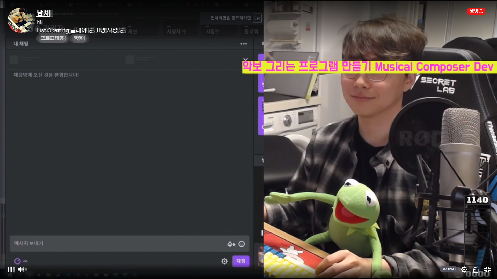

점토벽돌 (roth_sam): 자료구조를 c로 먼저 배우고 c++ 를 공부할까요?
아니면 c++ 공부하구 자료구조 할까요?
Should I learn Data Structure in C first, then C++ next?
Or C++ first and D.S. next?

아무거나 하시면 됩니다.
Do anything anyway.
왜죠?
Why?
저 주제들의 순서는 그렇게 중요하지 않기 때문입니다.
The order of that subjects is not important.

뭔말임?
What?
저 주제들은 서로 연관이 그렇게까진 없어요.
No relations between them.

자료구조 : Data Structure
는 개념입니다. Is Concept.

C, C++ 서로 관계 없습니다. not be related.
C++ 배우고 C 배워도 늦지 않습니다.
You even learn C++ then C, not wrong. Like our life.
우리 인생 잘못되지 않았습니다.

저도 이 노래를 정말 싫어했는데
I also hated this song,
나중에 이 노래 찾더라구요.
But later, I tried to find this song.... :)

ㄴㄷㅆ? 너 강퇴

꼭 C 안해도 돼요.
You don't have to learn C.

Python vs Ruby
Namse's Choice : Python
저의 선택 : 파이썬

왜냐? Why?
Python = Name of Starcraft's  map. 스타크래프트 맵 이름임.
Ruby = 과금해야함 Expensive.

꼬우면 아시죠?
You disgusting? OK.

점토벽돌 (roth_sam): 뭐 만들려고해도 생각하는건 gui 밖에 생각안나는데
C++로 할려면 뭔가 어려울것같음.
When I try to make something, I need GUI.
But it seems difficult to make in C++

남세스 답변 : 무조건 그렇진 않습니다! Not very true~!
# Imgui

google: imgui github
https://github.com/ocornut/imgui

used by Unity(Unity3D)

# QT
Blizzard use this for product.
Name is BATTLE.NET

# Chromium Embedded Framework
CEF
Riot Game's League of Legend.
Lobby of LOL used CEF.

blog : https://technology.riotgames.com/news/architecture-league-client-update

CEF - FE : Browser, BE : C++
Electron - FE : Browser, BE : Node.js
We can make Electron using CEF

Q. C vs Rust (in Embedded)
C.

So.
I gonna finish my Piano Game Project before starting other game dev.
다른 게임 개발 전에 피아노 게임 먼저 끝낼게요.

What we gonna do now : Composing System
지금 할건 : 작곡 시스템

In my opinion, we should provide two Composing System
1. Classic (with musical note)
2. Beat Map

One Musical Score must be compatible between both Composing System.
하나의 악보가 두가지 시스템에서 모두 돌 수 있어야 합니다.

AND!!
그리고!!
We don't use midi again.
Midi 다신 안쓸겁니다.

Name Of Musical Score Data Structure?
아 몰라~

Musical Score Data Architecture

In our office,
there are many people who is smart like me, or smart than me.
사무실에
저만큼, 혹은 더보다 더 똑똑한 분들이 많아요.

And I guess, MS or Apple, Google HQ employees are smarter than me.

But being smart is not important.
It's important that you know me. OK? ok.
똑똑한건 중요하지 않아요.
여러분들이 절 알아주고, 인정해주는 것이 중요합니다. 어게이? 어게이.

Nobody knows me? I not exists. OK? ok.

In game Fate Stay Night,
The power of Servant(Hero) is related with popularity of Servant.
페이트 스테이 나이트라는 게임에선
서번트(영웅)의 힘은 그 서번트가 얼마나 유명한지에 따라 달려있어요.

is the.... same. ok? ok.
비슷합니다. 오케이?

제가 아무리 방구석 천재라고 하면 뭐합니까?
결국 그것을 잘 활용하고, 실현하려면 여러분들과 만나야만 합니다.
It will be nothing if I'm unknown genius.
Actually I have to meet you, to use my talent, to make world better

Musical Score Data Architecture

1. Actually Sound (Note) 실제 소리
  - Duration 길이
  - Pitch 음높이
2. Displaying 보이는 것
  - BPM(Beat per Minute) 분당 비트 수
  - Clef 음자리표
  - Key Signature 조표
  - Marks 표시들
    - Dynamics 셈여림표
    - Articulation

Let's make Manuscript Paper

람넷 (peantal0): 근데 왜 텍스트로 눈을 가렸나요
Why you hide you eyes?

제 깊은 눈에 여러분들이 빠져버릴까봐요
Because you may fall in my DEEP eyes.

Cororonoa: Do you believe the Universe is finite or infinite or maybe even some third option?
여러분들은 우주가 유한하다고 생각하세요? 아니면 무한?
아니면 다른 옵션?

In my opinion, I believe the Universe is finite.
저는 우주가 유한하다고 생각합니다.

Because the Past and Current is finite.
왜냐하면 과거와 현재가 유한하기 때문입니다.

the Time is continuous, so the Future will be Current and Past.
시간은 연속적입니다. 그러기 때문에 미래는 현재가 되고, 과거가 됩니다.

Cororonoa: If the Universe is finite, does that mean there is a "biggest number"?
만약 우주가 유한하면, 가장 큰 숫자라는 것이 있을까요?

You didn't ask me about "TIME" haha. I answer about time.
님 시간에 대해서 묻지 않았는데 제가 시간이라고 대답해버렸네요.

Sorry, I need to think again
다시 생각해야겠어요.

The Universe doesn't have every concept.
우주는 모든 개념을 소유하고 있지 않습니다.
That mean, Each concept isn't the part of the Universe.
즉, 각 개념은 우주의 일부가 아닙니다.

Is the... Theory isn't the Reality
마치.. 이스더.. 이론은 현실이 아닌 것 처럼요.

I want to define "Universe" is "Reality"
저는 우주를 현실이라고 정의하고 싶어요.

So, Hmm. It isn't related existence of Biggest Number with that the Universe is finite.
그래서 가장 큰 숫자의 존재와 우주가 유한함은 관련이 없습니다.

람넷 (peantal0): 아직 확장하고 있는거 아니였나요
Isn't the Universe expanding?

맞죠
Yes

Cororonoa: Time is important when talking about infinity, because you need infinite time to measure something that is infinite. Your answer was good.
시간은 무한이라는 것을 얘기할 때 매우 중요합니다. 왜냐하면 무한한 것을 측정하기 위해서는 무한한 시간이 필요하기 때문입니다. 당신의 대답은 훌륭합니다.

Give me sec, my previous answer about the Time is not about finite/infinity problem.
잠시만요, 아까 제 시간에 대한 대답은 유한/무한 문제에 대한 대답이 아니었어요.
It was about... existence of multiple future.
그것은 다중 미래가 존재하는지에 대한 것이었어요.

The Past is only one.
과거는 하나에요.
The Current is only one.
현재는 하나에요.
So, the Future will be the Current and the Past.
그리고, 미래는 현재가 되고, 과거가 돼요.
That mean, the Future is only one.
그 뜻은, 미래는 하나라는 것이죠.

But we don't know where future is infinity.
하지만 우리는 미래가 무한할진 몰라요.

I have a good idea.
좋은 아이디어가 있어요.

Let's take a screenshot(snapshot) of this Universe.
우주를 스크린샷(스냅샷) 찍어봅시다.

is the size of Universe Screenshot is finite or infinite?
우주의 스크린샷은 유한할까요? 아니면 무한할까요?

To answer this one, Let's think other screenshots.
이걸 대답하기 위해서, 다른 스크린샷들을 생각해봅시다.

If we take picture of finite thing, the picture's size is finite.
유한한 것의 사진을 찍으면, 사진의 크기도 유한합니다.

If we take snapshot of infinite thing,... like a...
무한한 것을 사진 찍어 봅시다. 마치...
Let's take a whole picture of "Infinite Size-Room".
무한한 크기의 방을 사진찍어봅시다.

Definitely picture's size is infinite.
당연히 사진의 크기는 무한입니다.

Taking picture mean stopping time.
사진을 찍는 것은 시간을 멈추는 것입니다.

So that mean, Time axis isn't big deal whether something is finite or infinite.
그러므로, 시간은 무언가가 유한하거나 무한한것과는 관련이 없습니다.

I found answer
답을 찾았어요.

Answer : It depends on the time when you want to measure the Universe is finite or infinite.
정답 : 우주가 유한할지 무한할지는 당신이 어떤 시간에 그 크기를 재고 싶은지에 따라 달려있어요.

Here is example.
예시가 있어요.

Let's say, there is bucket with beans.
통 안에 콩이 있다고 합시다.

the number of beans is 0 in 2020-01-11.
콩은 2020년 1월 11일에 0개 있습니다.

I will put 1 beans per day.
저는 콩을 하루에 1개씩 넣을 것입니다.

If I measure the number of beans at exact one day, I can calculate that. That mean, it's finite.
제가 콩의 갯수를 어느 한 날에 재려고 하면, 저는 그것을 계산할 수 있습니다. 그 말은, 이것은 유한합니다.

But, the number of beans can be finite.
하지만, 콩의 갯수는 무한할 수 있습니다.

How?
어떻게요?

If I want to measure at "the last day", or the day after infinite days...
만약 제가 콩을 "마지막 날", 혹은 "무한한 날 후"에 갯수를 쟤려고 한다면?

The number of bean become infinite.
콩의 갯수는 무한해집니다.

The Universe is the same.
우주 또한 마찬가지입니다.

We believe the Universe start with Big Bang.
우리는 우주가 빅뱅으로부터 시작되었다고 믿습니다.

At that time, Universe was one dot.
그때는 우주가 점 하나였죠.

It become bigger.
점점 커집니다.

Very same with my example.
제 예시와 매우 같죠?

Cororonoa: I understand problem. You need to have infinite time and resources to measure infinity. We only have finite time and resources. If the Universe is infinite we can only measure a finite amount of it.
문제를 이해했습니다. 무한한 것을 쟤려면 무한한 시간과 리소스가 필요합니다.
우리는 유한한 시간과 리소스를 가지고 있습니다.
만약 우주가 무한하다면 우리는 오직 유한한 것만 쟬 수 있습니다.

But my answer is, the snapshot of the Universe is finite At right NOW.
근데 제 대답은, 지금 찍은 우주의 스냅샷은 유한하다는 거에요.

Because the start of the Universe was Finite. The duration between "BIG BANG TIME" and "NOW" is Finite.
왜냐하면 우주의 처음은 유한하기 때문이에요. 빅뱅으로부터 지금까지의 시간도 유한하죠.

Cororonoa: Is there any way to know how many times the Universe has started and ended already?
우주가 얼마나 다시 시작했꼬 끝났는지 알수 있음?
We don't know :)
모르죵

Finite Start * Finite Time = Finite
유한한 시작 * 유한한 시간 = 유한
Finite Start(!= 0) * Infinite Time = Infinity
유한한 시작(0 빼고) * 무한한 시간 = 무한
Infinity Start * Finite Time(!= 0) = Infinity
무한한 시작 * 유한한 시간(0 빼고) = 무한
